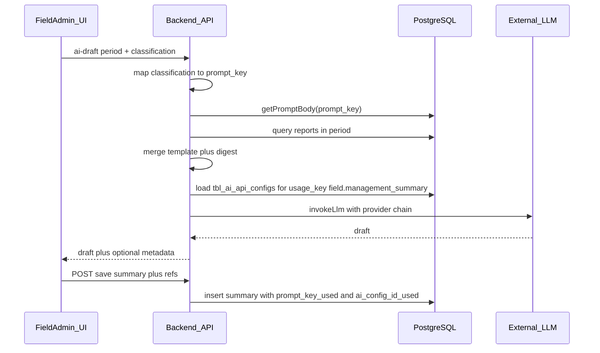

# طرح: خلاصه مدیریتی گزارشات میدانی + رجیستری پرامپت سراسری

## وضعیت فعلی (مرجع کد)

- گزارش میدانی در `[backend/report_backend/src/routes/reports.js](backend/report_backend/src/routes/reports.js)` روی جدول `tbl_unit_events`؛ فیلد **دامنه انتشار** با `classification` عددی ۱=عمومی، ۲=استانی، ۳=واحد، ۴=خاص (توابع `parseClassification` / `mapClassificationToFa` همین فایل).
- فهرست گزارش‌ها برای بازه با `[GET /api/reports/admin/monitor](backend/report_backend/src/routes/reports.js)` و پارامترهای `startDate`, `endDate`, `classification` (و فیلترهای دیگر) قابل واکشی است.
- نقش **مدیر کل** = `admin` و **مدیر گزارشات میدانی** = `Field_admin` در `[frontend/src/utils/userRoles.js](frontend/src/utils/userRoles.js)`.
- خروجی PDF فارسی در بک‌اند با pdfmake در `[backend/report_backend/src/services/pdfExport.js](backend/report_backend/src/services/pdfExport.js)` الگو دارد؛ **خروجی Word** در مخزن فعلی دیده نشد (فقط Excel در `[frontend/src/utils/excelExport.js](frontend/src/utils/excelExport.js)`).
- فراخوانی AI در فرانت با `[frontend/src/services/aiManager.js](frontend/src/services/aiManager.js)` (کلید در کلاینت) — برای این قابلیت بهتر است **فراخوانی مدل فقط از بک‌اند** با متغیر محیطی (مثلاً `GEMINI_API_KEY`) انجام شود تا پرامپت و داده گزارش‌ها در سرور بماند.

---

## بخش جدید: رجیستری پرامپت (برای کل برنامه)

به‌جای جدول جدا فقط برای ۴ دامنه میدانی، یک **منبع واحد پرامپت** تعریف می‌شود تا هر بخش با یک **کلید پایدار** (`prompt_key`) به همان رجیستری ارجاع دهد. مثال قرارداد نام‌گذاری (پیشنهادی):

- الگوی `دامنه.قابلیت.زیربخش` — مثلاً `field.management_summary.classification_1` … `_4` برای خلاصه مدیریتی میدانی.
- برای آینده: `news.summarize.default`، `analysis.review.rubric`، و غیره — بدون تغییر اسکیما.

### جدول `tbl_app_prompts` (یا نام مشابه)

| ستون | نوع | توضیح |
|------|-----|--------|
| `prompt_key` | VARCHAR، **UNIQUE** | شناسه پایدار برای کد؛ در بک‌اند/فرانت در فایل ثابت‌ها (`promptKeys.js`) همان رشته‌ها تکرار شوند تا typo نشود. |
| `title_fa` | VARCHAR | عنوان کوتاه برای UI مدیر (مثلاً «خلاصه مدیریتی — دامنه عمومی»). |
| `description_fa` | TEXT اختیاری | راهنمای اینکه این پرامپت کجا استفاده می‌شود و چه placeholderهایی دارد. |
| `body` | TEXT | متن قالب؛ **حداکثر ۵۰۰۰ کاراکتر** (اعتبارسنجی یکسان در فرانت و بک‌اند). placeholderها در راهنمای فرم توضیح داده شوند. |
| `updated_at`, `updated_by` | — | ردیابی آخرین ویرایشگر (اختیاری). |

**Seed اولیه (مهاجرت):** چهار ردیف با کلیدهای ثابت برای خلاصه مدیریتی میدانی + متن پیش‌فرض حداقلی تا قبل از ویرایش مدیر کل سیستم بالا بیاید.

### API عمومی پرامپت (پیشنهاد: `/api/prompts` یا `/api/admin/prompts`)

- `GET /` — لیست (با query `prefix=field.` برای فیلتر)؛ فقط `admin`.
- `GET /:prompt_key` — دریافت یک پرامپت؛ `admin` (و در صورت نیاز فقط برای دیباگ؛ **خواندن برای Field_admin لازم نیست** اگر کلید فقط سمت سرور resolve شود).
- `PUT /:prompt_key` — ایجاد/به‌روزرسانی (upsert)؛ فقط `admin`؛ بدنه با محدودیت طول بررسی شود.

### محدودیت کاراکتر و هم‌راستایی با فرم‌های موجود

- **متن پرامپت (`body`):** حداکثر **۵۰۰۰ کاراکتر** (طبق درخواست).
- **ثابت‌ها:** افزودن `PROMPT_FIELD_LIMITS` (یا بخشی در فایل limits موجود) در **هر دو** `[frontend/src/constants/](frontend/src/constants/)` و `[backend/report_backend/src/constants/](backend/report_backend/src/constants/)` با همان نام فیلدها تا فرانت و بک‌اند یکسان بمانند — الگو از `[FIELD_FIELD_LIMITS](frontend/src/constants/fieldFieldLimits.js)` و تابع `validateLength` در `[fieldFieldLimits.js بک‌اند](backend/report_backend/src/constants/fieldFieldLimits.js)`.
- **فرانت‌اند:** همان الگوی فرم‌های تحلیل/میدانی:
  - برش ورودی با [`clampText` / `createLimitedChange`](frontend/src/utils/limitInput.js) روی `onChange`؛ در صورت تمایل `maxLength` روی textarea.
  - **شمارندهٔ کاراکتر** (`CharCounter` + برچسب فیلد) مانند [`TopicFormModal.jsx`](frontend/src/components/analysis/TopicFormModal.jsx).
  - **بلوک راهنما:** کامپوننت کمکی جدید در [`frontend/src/content/`](frontend/src/content/) (مثلاً `promptFormHelp.jsx`) با همان ساختار بخش‌بندی‌شدهٔ [`fieldFormHelp.jsx`](frontend/src/content/fieldFormHelp.jsx) (`helpSection`، فونت و `textAlign: justify`)؛ ذکر صریح سقف ۵۰۰۰ کاراکتر، معنی placeholderها، و اینکه `prompt_key` از فرم ویرایش نمی‌شود (فقط از لیست/ردیف انتخاب می‌شود) در صورت UX انتخابی.
  - **مودال راهنما** با آیکن سوال / دکمه «راهنما» مانند الگوی مانیتور میدانی در صورت وجود در پروژه برای فرم‌های مدیریتی.
- **بک‌اند:** در هندلر `PUT` پرامپت، اعتبارسنجی با همان سقف‌ها قبل از `INSERT/UPDATE`؛ پاسخ ۴۰۰ با پیام فارسی مشابه سایر routeها.
- **فیلدهای دیگر پرامپت** (`title_fa`, `description_fa`): سقف معقول در همان فایل ثابت (مثلاً عنوان ~۱۲۰ و توضیح ~۱۵۰۰) تا با بقیهٔ فرم‌ها هم‌خوان باشد — اعداد دقیق در پیاده‌سازی در همان `PROMPT_FIELD_LIMITS` قفل شوند.

### لایه سرویس بک‌اند

- تابع `getPromptBody(promptKey)` — اگر ردیف نبود: خطای واضح یا (فقط جاهای مشخص‌شده) fallback به متن پیش‌فرض کد؛ ترجیحاً برای پرامپت‌های حیاتی همان seed کافی است.
- هر ماژول جدید فقط **کلید را import می‌کند** و هنگام فراخوانی AI از `getPromptBody` می‌خواند؛ نیازی به JOIN اختصاصی به «نوع گزارش» در DB نیست مگر اینکه بخواهید mapping را هم در DB نگه دارید (برای نسخه اول **mapping classification → prompt_key در کد** ساده‌تر و شفاف‌تر است).

### UI مدیر کل: «مدیریت پرامپت‌ها»

- یک صفحه/مسیر جدا (مثلاً `/prompt-management`) با permission جدید `manage_prompts` فقط برای `admin` (یا تکیه بر `admin` در `hasRole` بدون permission جدید — سلیقه‌ای).
- جدول: کلید، عنوان فارسی، تاریخ به‌روزرسانی، دکمه ویرایش.
- فرم ویرایش: textarea برای `body` با **شمارنده ۰/۵۰۰۰**، فیلد عنوان و توضیح با سقف‌های ثابت؛ لیست placeholderها در **راهنمای فرم** (نه فقط متن خاکستری کوتاه)؛ دکمه باز کردن مودال راهنما مطابق الگوی فرم‌های دیگر.
- **خلاصه مدیریتی میدانی** دیگر فرم ۴تایی مجزا ندارد؛ همان صفحه با فیلتر `field.management_summary` یا لینک سریع «پرامپت‌های گزارش میدانی» از داشبورد میدانی به همان صفحه با query.

---

## بخش جدید: مدیریت پیکربندی APIهای هوش مصنوعی

هدف: مدیر کل **بدون تغییر کد** بتواند برای هر **کاربرد** (`usage_key`) مشخص کند چه **نوع ارائه‌دهنده**ای (مثلاً Gemini، OpenAI)، چه **مدلی**، و با چه **اولویتی** (چند ردیف = زنجیره fallback مثل `aiManager` فعلی) استفاده شود. بقیهٔ برنامه فقط `usage_key` ثابت را صدا می‌زند.

### جدول پیشنهادی `tbl_ai_api_configs`

- `id` SERIAL PK
- `usage_key` VARCHAR — شناسه کاربرد در کد؛ مثلاً `field.management_summary` (برای خلاصه مدیریتی میدانی)، بعداً `news.ai_rewrite` و غیره. ایندکس روی `(usage_key, sort_order)`.
- `sort_order` INT — ترتیب تلاش برای همان `usage_key` (۰ = اولویت اول). چند ردیف با یک `usage_key` = failover.
- `title_fa` VARCHAR — برچسب خوانا در UI («Gemini برای خلاصه میدانی»).
- `provider_type` VARCHAR — مقادیر کنترل‌شده در کد: مثلاً `google_gemini`، `openai_chat` (افزودن provider جدید = توسعهٔ یک adapter در بک‌اند، نه تغییر DB).
- `model_id` VARCHAR — شناسه مدل نزد همان provider.
- `extra_config` JSONB اختیاری — `temperature`، `maxOutputTokens`، `base_url` سفارشی در صورت نیاز.
- `credential_mode` ENUM ساده در DB یا VARCHAR:  
  - **`env_ref`**: فقط نام متغیر محیطی ذخیره می‌شود (مثلاً `GEMINI_API_KEY_FIELD`) — امن‌ترین حالت برای production؛ مقدار در `.env` سرور است.  
  - **`stored_secret`**: ذخیرهٔ رمزنگاری‌شده در DB با کلید مشتق از `APP_ENCRYPTION_KEY` یا مشابه — فقط اگر الزام به ورود کلید از UI دارید؛ پیاده‌سازی و چرخش کلید را در طرح صریح کنید.
- `is_enabled` BOOLEAN
- `created_at`, `updated_at`, `updated_by`

**Seed:** یک ردیف برای `usage_key = field.management_summary` با `provider_type = google_gemini` و `credential_mode = env_ref` و نام متغیر پیشنهادی، تا پس از deploy با تنظیم env کار کند.

### API مدیریت (فقط `admin`)

مسیر پیشنهادی: `/api/admin/ai-api-configs`

- `GET /` — لیست با فیلتر `usage_key` / `provider_type`؛ در پاسخ **هرگز** مقدار کامل secret برنگردد (فقط `credential_mode` و در صورت `stored_secret` فقط `has_secret: true` یا آخرین ۴ کاراکتر).
- `POST /` — ایجاد ردیف جدید.
- `PUT /:id` — به‌روزرسانی (مدل، فعال، ترتیب، چرخش کلید).
- `DELETE /:id` — حذف.
- اختیاری: `POST /:id/test` — یک درخواست سبک به API برای تأیید اعتبار (بدون لاگ کردن body حاوی کلید).

### سرویس یکپارچهٔ LLM در بک‌اند

- `invokeLlm({ usageKey, promptText })` — ردیف‌های `is_enabled` برای آن `usage_key` را به ترتیب `sort_order` می‌خواند؛ برای هر ردیف adapter مناسب را صدا می‌زند؛ در خطای ۴۰۴/۴۲۹/۵xx به ردیف بعدی می‌رود (مشابه منطق فعلی `[frontend/src/services/aiManager.js](frontend/src/services/aiManager.js)` ولی از DB تغذیه می‌شود).
- **اتصال به خلاصه میدانی:** `ai-draft` همیشه با `usage_key = field.management_summary` فراخوانی می‌کند (ثابت در `aiUsageKeys.js` کنار `promptKeys.js`).

### UI مدیر کل: «مدیریت APIهای هوش مصنوعی»

- مسیر جدا (مثلاً `/ai-api-management`) یا تب کنار مدیریت پرامپت.
- جدول: کاربرد (`usage_key`)، عنوان فارسی، نوع، مدل، فعال، ترتیب.
- فرم: انتخاب `usage_key` از لیست پیش‌فرض (enum در فرانت از همان ثابت‌های بک‌اند) + امکان ورود دستی برای آینده؛ انتخاب provider از dropdown؛ فیلد مدل؛ سوئیچ فعال؛ عدد ترتیب؛ بخش اعتبارنامه (یا نام env یا paste کلید با هشدار امنیتی). **حدود طول فیلدها** در `AI_API_FIELD_LIMITS` (مثلاً `model_id`، `title_fa`، نام env) + شمارنده و راهنمای `aiApiFormHelp.jsx` همان الگوی پرامپت.
- دکمه «تست اتصال» در صورت پیاده‌سازی endpoint تست.

---

## مدل داده خلاصه مدیریتی (PostgreSQL)

مهاجرت علاوه بر `tbl_app_prompts` و `tbl_ai_api_configs`:

1. `**tbl_field_management_summaries**`
  - شناسه، `title`، `period_kind` (`weekly` | `monthly` | `semi_annual` | `annual`)
  - `period_end` DATE، `period_start` DATE (محاسبه‌شده و ذخیره‌شده)
  - `classification` SMALLINT
  - اختیاری برای شفافیت تاریخی: `prompt_key_used` VARCHAR — همان کلید پرامپت رجیستری.
  - اختیاری: `ai_usage_key_used` VARCHAR و/یا `ai_config_id_used` — برای ممیزی اینکه کدام پیکربندی API در لحظهٔ تولید پیش‌نویس استفاده شده است.
  - `summary_body` TEXT، `created_by`, `created_at`, `updated_at`، در صورت تمایل فیلدهای ردیابی AI

2. `**tbl_field_mgmt_summary_report_refs`**
  - `summary_id` FK، `hash_key` — لیست مرجع گزارش‌ها؛ خروجی مجدد با JOIN به `tbl_unit_events`.

**تغییر نسبت به طرح قبلی:** حذف جدول اختصاصی `tbl_field_mgmt_summary_prompts` به نفع `tbl_app_prompts`.

---

## منطق بازه زمانی

- ورودی کاربر: `period_kind` + `period_end`.
- بک‌اند `period_start` را محاسبه و ذخیره کند (قانون یکسان با `BETWEEN` مانیتور؛ در مستند کوتاه ثابت شود).
- واکشی گزارش‌های مرجع: همان منطق مانیتور + `classification` (+ سیاست state در صورت نیاز).

---

## APIهای خلاصه میدانی (زیر `/api/reports`)

| مسیر | نقش | توضیح |
|------|-----|--------|
| `POST /admin/management-summaries/preview-reports` | `admin`, `Field_admin` | پیش‌نمایش لیست در بازه |
| `POST /admin/management-summaries/ai-draft` | `admin`, `Field_admin` | `prompt_key` از classification → `getPromptBody` → جایگذاری → **`invokeLlm({ usageKey: 'field.management_summary', ... })`** |
| `POST /admin/management-summaries` | همان | ذخیره + refs |
| `GET /admin/management-summaries` / `:id` | همان | لیست و جزئیات |
| `GET .../export.pdf` / `export.docx` | همان | خروجی |

**کنترل دسترسی:** middleware نقش روی endpointهای جدید؛ رجیستری پرامپت و **پیکربندی APIهای AI** فقط `admin`.

---

## فرانت‌اند

- **مدیریت پرامپت** و **مدیریت APIهای AI:** دو صفحهٔ جدا (یا یک shell با تب)؛ لینک از منوی «مدیریت و گزارشات».
- **خلاصه میدانی:** مسیر جدید در `[App.jsx](frontend/src/App.jsx)` و `[MainForm.jsx](frontend/src/pages/MainForm.jsx)`؛ بدون وابستگی مستقیم به ویرایش ۴ پرامپت در همان صفحه (فقط لینک به مدیریت پرامپت در صورت نیاز).
- چاپ / PDF / Word همان‌طور که در طرح قبلی آمده (header axios برای دانلود).

---

## جریان هوش مصنوعی (به‌روز)

---

## توسعه بعدی سایر بخش‌ها (بدون تغییر اسکیما)

1. ثابت `PROMPT_KEYS.xyz` و در صورت نیاز `AI_USAGE_KEYS.xyz` در بک‌اند.
2. ردیف در `tbl_app_prompts` و در صورت نیاز یک یا چند ردیف در `tbl_ai_api_configs` با همان `usage_key`.
3. در سرویس همان بخش: `getPromptBody` + `invokeLlm({ usageKey })`.

---

## نکات کیفیت و امنیت

- فراخوانی LLM فقط از بک‌اند؛ **کلید API در پاسخ API مدیریت یا لاگ‌ها برنگردد و لاگ نشود.**
- ترجیح production: `credential_mode = env_ref` تا اسرار در DB نماند؛ اگر `stored_secret` لازم است، رمزنگاری-at-rest و سیاست چرخش کلید تعریف شود.
- پرامپت‌های حساس فقط برای `admin` قابل ویرایش؛ پیکربندی AI نیز فقط `admin`.
- محدودیت طول: **`body` پرامپت حداکثر ۵۰۰۰ کاراکتر**؛ سایر فیلدها طبق `PROMPT_FIELD_LIMITS` / `AI_API_FIELD_LIMITS` در فرانت و بک‌اند.
- PDF/Word: خلاصه + جدول مراجع.

---

## فایل‌های کلیدی برای تغییر

- بک‌اند: روت `prompts.js`، روت `aiApiConfigs.js`، سرویس‌های `promptRegistry.js`، `llmRouter.js` (یا `aiInvokeService.js`) با adapterها؛ روت خلاصه میدانی؛ `[server.js](backend/report_backend/src/server.js)`؛ مهاجرت SQL؛ `promptKeys.js` و `aiUsageKeys.js`؛ **`promptFieldLimits.js` / `aiApiFieldLimits.js`** (یا تجمیع در یک فایل limits) با `validateLength`.
- فرانت: `PromptManagement.jsx`، `AiApiManagement.jsx`؛ **`promptFormHelp.jsx`، `aiApiFormHelp.jsx`**؛ مسیرها و permission؛ خلاصه میدانی (فرم خلاصه نیز در صورت وجود فیلدهای متنی طبق همان الگو و limits مربوط به خلاصه).

---

## کارهای تست دستی پیشنهادی

- CRUD پرامپت؛ رد درخواست با بدنه > ۵۰۰۰ کاراکتر در بک‌اند؛ شمارنده فرانت با `limitInput`.
- CRUD پیکربندی AI؛ دو ردیف fallback برای یک `usage_key`؛ غیرفعال کردن ردیف اول و اطمینان از استفاده از دومی.
- تست اتصال (در صورت وجود endpoint).
- خلاصه میدانی: `ai-draft` با پرامپت + زنجیرهٔ provider؛ ذخیره و بررسی `prompt_key_used` / `ai_config_id_used`.
- seed حذف نشود؛ ویرایش مدیر کل persist شود.
